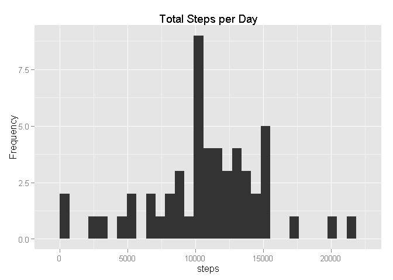
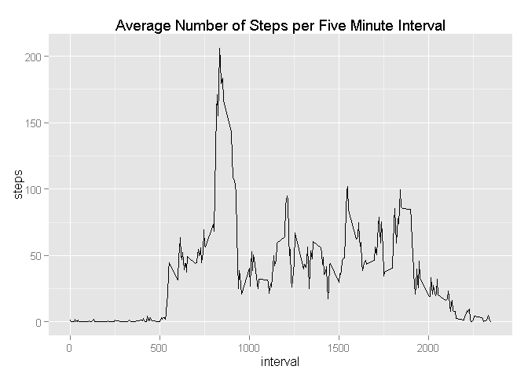
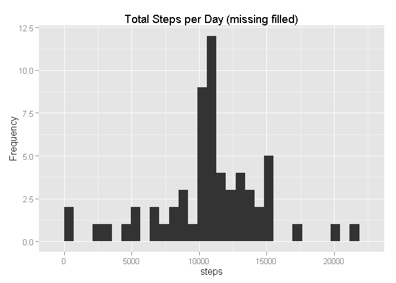
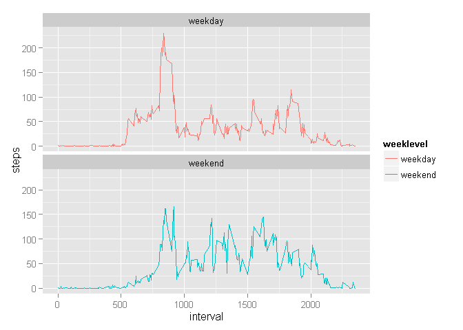

# Reproducible Research: Peer Assessment 1
### Basic settings

```r
echo = TRUE  # Make code chunks visible
# Load required packages
library(knitr)
library(dplyr)
```

```
## 
## Attaching package: 'dplyr'
## 
## The following objects are masked from 'package:stats':
## 
##     filter, lag
## 
## The following objects are masked from 'package:base':
## 
##     intersect, setdiff, setequal, union
```

```r
library(lubridate)
library(ggplot2)
# Set working directory
setwd("C:/RepData_PeerAssessment1")
```
## Loading and preprocessing the data
* Load the data

```r
# Download and extract project data into working directory
# Read in data file
activity <- read.csv("activity.csv", header=T, sep=",")
```
* Process the data and check

```r
# Convert date and check data
activity$date <- ymd(activity$date)
activity$day <- wday(activity$date, label = TRUE)
str(activity)
```

```
## 'data.frame':	17568 obs. of  4 variables:
##  $ steps   : int  NA NA NA NA NA NA NA NA NA NA ...
##  $ date    : POSIXct, format: "2012-10-01" "2012-10-01" ...
##  $ interval: int  0 5 10 15 20 25 30 35 40 45 ...
##  $ day     : Ord.factor w/ 7 levels "Sun"<"Mon"<"Tues"<..: 2 2 2 2 2 2 2 2 2 2 ...
```

```r
head(activity)
```

```
##   steps       date interval day
## 1    NA 2012-10-01        0 Mon
## 2    NA 2012-10-01        5 Mon
## 3    NA 2012-10-01       10 Mon
## 4    NA 2012-10-01       15 Mon
## 5    NA 2012-10-01       20 Mon
## 6    NA 2012-10-01       25 Mon
```
## What is mean total number of steps taken per day?
* Calculate the total number of steps taken per day

```r
dailysteps <- aggregate(steps ~ date, data=activity, FUN=sum)
head(dailysteps)
```

```
##         date steps
## 1 2012-10-02   126
## 2 2012-10-03 11352
## 3 2012-10-04 12116
## 4 2012-10-05 13294
## 5 2012-10-06 15420
## 6 2012-10-07 11015
```
* Make a histogram of the total number of steps per day

```r
ggplot(dailysteps, aes(x = steps)) +
    geom_histogram() +
    labs(title = "Total Steps per Day", y = "Frequency")
```

```
## stat_bin: binwidth defaulted to range/30. Use 'binwidth = x' to adjust this.
```

 

* Calculate mean and median of total number of steps per day

```r
mean(dailysteps$steps, na.rm = TRUE)
```

```
## [1] 10766.19
```

```r
median(dailysteps$steps, na.rm = TRUE)
```

```
## [1] 10765
```
## What is the average daily activity pattern?
* Make a time series plot of five minute intervals

```r
avgsteps <- aggregate(steps ~ interval, data=activity, FUN=mean)
ggplot(avgsteps, aes(x=interval, y=steps)) +
    geom_line() +
    labs(title = "Average Number of Steps per Five Minute Interval")
```

 

* Identify which five minute interval contains maximum number of steps

```r
avgsteps[which.max(avgsteps$steps),]
```

```
##     interval    steps
## 104      835 206.1698
```
## Imputing missing values
* Calculate the total number of missing values

```r
sum(is.na(activity))
```

```
## [1] 2304
```
* Create a new dataset with missing data filled in

```r
names(avgsteps)[2] <- "meansteps"
fill <- merge(activity, avgsteps, by="interval")
fill$steps[is.na(fill$steps)] <-  fill$meansteps[is.na(fill$steps)]
# Check that there are no missing values
sum(is.na(fill$steps))
```

```
## [1] 0
```
* Make a histogram of total number of steps per day with missing values filled in

```r
dailysteps_fill <- aggregate(steps ~ date, data=fill, FUN=sum)
ggplot(dailysteps_fill, aes(x = steps)) +
    geom_histogram() +
    labs(title = "Total Steps per Day (missing filled)", y = "Frequency")
```

```
## stat_bin: binwidth defaulted to range/30. Use 'binwidth = x' to adjust this.
```

 

* Calculate new mean and median

```r
mean(dailysteps_fill$steps)
```

```
## [1] 10766.19
```

```r
median(dailysteps_fill$steps)
```

```
## [1] 10766.19
```
These values differ from the earlier estimates. Imputing missing values with the average number of steps in the same 5-min interval results in both the mean and the median equal to the same value: 10766.

## Are there differences in activity patterns between weekdays and weekends?
* Create new factor variable with two levels: "weekday" and "weekend"

```r
new_fill <- mutate(fill, weeklevel = ifelse(fill$day == "Sat" | fill$day == "Sun", "weekend", "weekday"))
new_fill$weeklevel <- as.factor(new_fill$weeklevel)
```
* Calculate average daily activity pattern with new factor

```r
avgsteps2 <- aggregate(steps ~ interval + weeklevel, data=new_fill, FUN=mean)
```
* Make panel time series plots of five minute intervals for weekdays and weekends

```r
ggplot(avgsteps2, aes(x=interval, y=steps, color = weeklevel)) +
    geom_line() + facet_wrap(~weeklevel, ncol = 1, nrow=2)
```

 

There are differences in activity patterns, with activity levels more consistent throughout the day on weekends.
